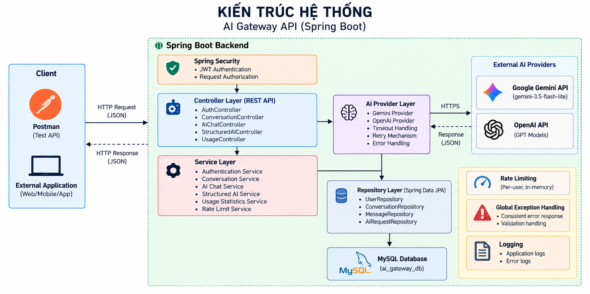
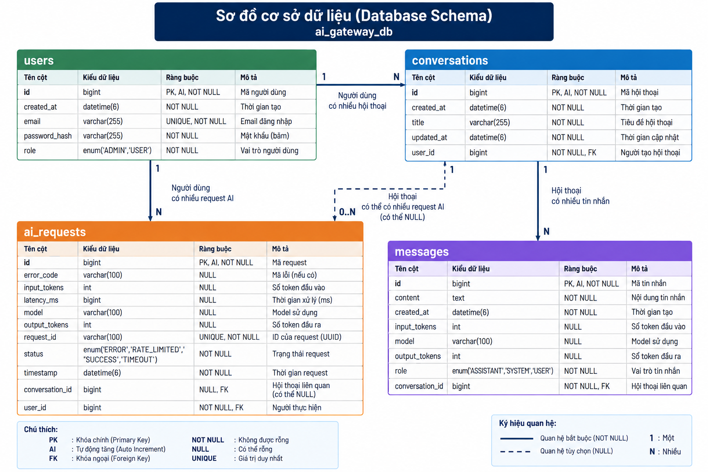

# AI Gateway API

AI Gateway API is a Spring Boot backend service that provides a centralized gateway for interacting with Large Language Model (LLM) providers.

The project was developed as a backend-focused AI Gateway, providing authentication, conversation management, AI provider integration, structured AI responses, request tracking, usage statistics, timeout handling, retry mechanisms, logging, and per-user rate limiting.

---

## Features

- JWT Authentication
- User registration and login
- MySQL database integration
- Conversation management
- Conversation ownership protection
- Google Gemini integration
- OpenAI provider support
- Structured AI output
- AI request tracking
- Input/output token tracking
- Request latency tracking
- Usage statistics
- Global exception handling
- Request validation
- Provider timeout handling
- Automatic retry mechanism
- Provider rate-limit handling
- Per-user Gateway rate limiting
- Application logging

---

## Tech Stack

- Java 21
- Spring Boot 4
- Spring Web MVC
- Spring Security
- OAuth2 Resource Server / JWT
- Spring Data JPA
- Hibernate
- MySQL 8
- Maven
- Google Gemini API
- OpenAI API support
- Postman

---

## Architecture

The application follows a layered architecture.

Main request flow:

```text
Client / Postman
       │
       ▼
Spring Security
JWT Authentication
       │
       ▼
REST Controllers
       │
       ▼
Service Layer
       │
       ├──────────────► LLM Provider Layer
       │                     │
       │                     ├──► Google Gemini API
       │                     │
       │                     └──► OpenAI API
       │
       ▼
Repository Layer
       │
       ▼
Spring Data JPA / Hibernate
       │
       ▼
MySQL
```

The AI processing flow also includes:

```text
AI Request
    │
    ▼
Rate Limiting
    │
    ▼
LLM Provider
    │
    ├── Timeout Handling
    ├── Retry Mechanism
    └── Error Handling
    │
    ▼
Usage Tracking
    │
    ├── Tokens
    ├── Latency
    └── Status
```

### System Architecture Diagram



---

## Database

The application uses MySQL.

Database name:

```text
ai_gateway_db
```

The database contains four main tables:

- `users`
- `conversations`
- `messages`
- `ai_requests`

### Main Relationships

```text
User 1 ─────── N Conversation

Conversation 1 ─────── N Message

User 1 ─────── N AIRequest

Conversation 1 ─────── 0..N AIRequest
```

`ai_requests.conversation_id` is nullable because not every AI request belongs to a conversation.

For example:

```text
POST /api/v1/ai/chat
→ AI request is associated with a conversation.

POST /api/v1/ai/structured
→ AI request does not require a conversation.
```

### Database Schema



### AI Request Tracking

Each AI request records:

- User
- Model
- Timestamp
- Latency
- Input tokens
- Output tokens
- Status
- Error code when applicable

Supported AI request statuses:

```text
SUCCESS
ERROR
TIMEOUT
RATE_LIMITED
```

---

## Project Structure

The project follows a layered Spring Boot structure.

```text
ai-gateway/
│
├── docs/
│   ├── architecture.png
│   └── database-schema.png
│
├── src/
│   ├── main/
│   │   ├── java/com/baotrung/ai_gateway/
│   │   │   ├── config/
│   │   │   ├── controller/
│   │   │   ├── dto/
│   │   │   ├── entity/
│   │   │   ├── exception/
│   │   │   ├── provider/
│   │   │   ├── repository/
│   │   │   └── service/
│   │   │
│   │   └── resources/
│   │       └── application.properties
│   │
│   └── test/
│
├── pom.xml
├── README.md
└── AI_WORKLOG.md
```

---

# Configuration

## Environment Variables

Secrets such as API keys and database credentials should not be committed directly to the repository.

The application supports environment variables such as:

```text
GEMINI_API_KEY
OPENAI_API_KEY
DB_URL
DB_USERNAME
DB_PASSWORD
```

Example Spring configuration:

```properties
spring.datasource.url=${DB_URL}
spring.datasource.username=${DB_USERNAME}
spring.datasource.password=${DB_PASSWORD}

gemini.api-key=${GEMINI_API_KEY:}
openai.api-key=${OPENAI_API_KEY:}
```

> Never commit real API keys or database passwords to Git.

---

## Gemini Configuration

Example:

```properties
gemini.base-url=https://generativelanguage.googleapis.com
gemini.api-key=${GEMINI_API_KEY:}
gemini.model=gemini-3.5-flash-lite

gemini.connect-timeout-ms=5000
gemini.read-timeout-ms=30000
gemini.max-retries=3
```

---

## Gateway Rate Limiting

Default configuration:

```properties
rate-limit.max-requests=10
rate-limit.window-seconds=60
```

The current implementation uses an in-memory per-user sliding-window rate limiter.

Each authenticated user can make up to:

```text
10 AI requests / 60 seconds
```

For a distributed production environment, a shared rate-limiting solution such as Redis could be used instead.

---

# Running Locally

## Requirements

Make sure the following software is installed:

- Java 21
- MySQL 8
- Maven or Maven Wrapper
- Postman
- A valid Gemini API key

---

## 1. Clone the Repository

```bash
git clone <YOUR_REPOSITORY_URL>
cd ai-gateway
```

---

## 2. Create MySQL Database

Run:

```sql
CREATE DATABASE ai_gateway_db
CHARACTER SET utf8mb4
COLLATE utf8mb4_unicode_ci;
```

---

## 3. Configure Database Connection

For local development:

```properties
spring.datasource.url=jdbc:mysql://localhost:3306/ai_gateway_db?useSSL=false&serverTimezone=Asia/Ho_Chi_Minh&allowPublicKeyRetrieval=true
spring.datasource.username=root
spring.datasource.password=YOUR_PASSWORD
```

Hibernate is currently configured with:

```properties
spring.jpa.hibernate.ddl-auto=update
```

Hibernate will update the required tables based on the application's JPA entities.

---

## 4. Configure Gemini API Key

Set:

```text
GEMINI_API_KEY=YOUR_GEMINI_API_KEY
```

For IntelliJ IDEA, the environment variable can be configured in the application's Run Configuration.

Do not store the real API key in the Git repository.

---

## 5. Run the Application

Using Maven Wrapper on Windows:

```bash
mvnw.cmd spring-boot:run
```

On Linux/macOS:

```bash
./mvnw spring-boot:run
```

Or run the Spring Boot application directly from IntelliJ IDEA.

The local API is available at:

```text
http://localhost:8080
```

---

# API Documentation

Most API endpoints are protected by JWT authentication.

Protected requests must include:

```http
Authorization: Bearer <access_token>
```

---

## Authentication

### Register

```http
POST /api/v1/auth/register
```

Creates a new user account.

Example request:

```json
{
  "email": "user@example.com",
  "password": "password123"
}
```

---

### Login

```http
POST /api/v1/auth/login
```

Authenticates the user and returns a JWT access token.

Example request:

```json
{
  "email": "user@example.com",
  "password": "password123"
}
```

Example response:

```json
{
  "accessToken": "<JWT_TOKEN>",
  "tokenType": "Bearer",
  "expiresIn": 3600
}
```

The returned token must be included in subsequent protected API requests.

---

## Conversations

Conversation endpoints require authentication.

### Create Conversation

```http
POST /api/v1/conversations
```

Creates a conversation for the authenticated user.

---

### Get Conversations

```http
GET /api/v1/conversations
```

Returns conversations belonging to the authenticated user.

---

### Get Conversation by ID

```http
GET /api/v1/conversations/{id}
```

Returns a specific conversation.

Conversation ownership is enforced. A user cannot access another user's conversation.

---

# AI Chat

### Send AI Chat Request

```http
POST /api/v1/ai/chat
```

Requires JWT authentication.

Example request:

```json
{
  "conversationId": 1,
  "message": "Explain Dependency Injection in Spring Boot.",
  "model": "gemini-3.5-flash-lite"
}
```

Example response:

```json
{
  "requestId": "generated-request-id",
  "conversationId": 1,
  "model": "gemini-3.5-flash-lite",
  "content": "Dependency Injection is...",
  "inputTokens": 25,
  "outputTokens": 120,
  "latencyMs": 1350
}
```

The Gateway:

1. Authenticates the user.
2. Verifies conversation ownership.
3. Loads previous conversation messages.
4. Sends the request to the selected LLM provider.
5. Stores the user and assistant messages.
6. Records usage information in `ai_requests`.
7. Returns the AI response.

---

# Structured AI Output

### Generate Structured Response

```http
POST /api/v1/ai/structured
```

Requires JWT authentication.

Example request:

```json
{
  "topic": "Dependency Injection in Spring Boot"
}
```

Example response:

```json
{
  "title": "Dependency Injection in Spring Boot",
  "summary": "Dependency Injection is a core Spring concept...",
  "keyPoints": [
    "Reduces coupling between components",
    "Dependencies are provided by the Spring container",
    "Constructor injection is commonly recommended"
  ]
}
```

The LLM is instructed to return JSON in a predefined structure.

The response is then parsed into a Java DTO before being returned to the client.

Structured AI requests are also recorded in `ai_requests`.

Because this endpoint does not require a conversation:

```text
conversation_id = NULL
```

is valid for these request records.

---

# Usage Statistics

### Get Usage Statistics

```http
GET /api/v1/usage
```

Requires JWT authentication.

Returns usage statistics belonging to the authenticated user.

Example response:

```json
{
  "totalRequests": 5,
  "totalInputTokens": 120,
  "totalOutputTokens": 350,
  "totalTokens": 470,
  "averageLatencyMs": 1250.4,
  "errorRate": 20.0
}
```

Statistics include:

- Total AI requests
- Total input tokens
- Total output tokens
- Total tokens
- Average latency
- Error rate

Usage data is calculated from the AI request records belonging to the authenticated user.

---

# Reliability

## Timeout Handling

Gemini requests have separate connection and read timeouts.

Default configuration:

```text
Connection timeout: 5 seconds
Read timeout:       30 seconds
```

A provider timeout is recorded as:

```text
TIMEOUT
```

---

## Retry Mechanism

Temporary provider failures can be retried automatically.

Current maximum:

```text
3 attempts
```

Retry is used for temporary conditions such as:

- Provider HTTP 429 responses
- Provider 5xx errors
- Network/resource access failures

---

## Provider Rate Limiting

If the external AI provider returns HTTP `429`, the Gateway retries the request according to the configured retry policy.

If the request still fails because of provider rate limiting, the request is recorded as:

```text
RATE_LIMITED
```

---

## Gateway Rate Limiting

The application also provides its own per-user rate limiting before sending requests to the AI provider.

Default:

```text
10 requests / 60 seconds / user
```

When the limit is exceeded, the API returns:

```http
HTTP 429 Too Many Requests
```

---

# Error Handling

The application uses centralized exception handling to provide consistent API error responses.

Example:

```json
{
  "timestamp": "2026-09-30T22:00:00",
  "status": 404,
  "error": "Not Found",
  "message": "Conversation not found",
  "path": "/api/v1/ai/chat"
}
```

Common HTTP status codes:

| Status | Description |
|---|---|
| `400` | Invalid request or validation error |
| `401` | Authentication required or invalid token |
| `404` | Resource not found or inaccessible |
| `429` | Gateway rate limit exceeded |
| `500` | Unexpected server error |

---

# AI Request Tracking

AI requests are stored in the `ai_requests` table.

Tracked information includes:

```text
user
request ID
model
timestamp
latency
input tokens
output tokens
status
error code
conversation (optional)
```

Possible statuses:

| Status | Description |
|---|---|
| `SUCCESS` | AI request completed successfully |
| `ERROR` | Request failed because of another error |
| `TIMEOUT` | AI provider request timed out |
| `RATE_LIMITED` | AI provider rate limit was reached |

This information is used to calculate user usage statistics.

---

# Logging

The application uses SLF4J-based application logging.

Logs include information such as:

- Provider calls
- Model being used
- Retry attempts
- Retry delays
- Application errors

Sensitive information such as API keys is not intentionally written to application logs.

---

# Security

The project implements the following security measures:

- Passwords are hashed using BCrypt.
- JWT authentication is used for protected endpoints.
- Authentication is stateless.
- Conversation access is scoped to the authenticated user.
- AI usage statistics are scoped to the authenticated user.
- API keys are loaded through environment variables.
- API keys are not intentionally included in application logs.
- Request validation is performed before processing invalid input.

---

# Multi-Provider Design

The application defines a common LLM provider abstraction.

```text
LLMProvider
    │
    ├── GeminiProvider
    │
    └── OpenAIProvider
```

This design allows additional AI providers to be integrated without changing the main AI Gateway API contract.

Google Gemini is currently used as the primary working provider.

OpenAI provider integration is also implemented, but successful requests require an OpenAI account/API key with available API credits.

---

# Development Notes

Hibernate currently uses:

```properties
spring.jpa.hibernate.ddl-auto=update
```

This configuration is convenient for development and demonstration because Hibernate can update the schema based on JPA entities without recreating the entire database on every application start.

For a production system, schema changes should preferably be managed through database migration tools such as:

- Flyway
- Liquibase

A production environment could also use:

```properties
spring.jpa.hibernate.ddl-auto=validate
```

after database migrations are managed separately.

---

# Deployment

Production API:

```text
TO_BE_ADDED_AFTER_DEPLOYMENT
```

Production deployment should configure the following values through environment variables:

```text
DB_URL
DB_USERNAME
DB_PASSWORD
GEMINI_API_KEY
OPENAI_API_KEY
```

The deployed backend should not depend on the developer machine's local MySQL instance.

---

# API Testing

The API can be tested using Postman.

The recommended test flow is:

```text
Register
   ↓
Login
   ↓
Get JWT
   ↓
Create Conversation
   ↓
AI Chat
   ↓
Structured AI
   ↓
Usage Statistics
```

A Postman collection is provided separately with the project.

---

# Project Deliverables

The project includes:

- Backend source code
- API documentation
- Architecture diagram
- Database schema
- Postman API examples
- Deployment configuration/instructions
- AI development worklog
- Demo video

---

# Future Improvements

Possible improvements for a production-ready version include:

- Redis-based distributed rate limiting
- Automatic provider fallback
- Dynamic model routing
- Response caching
- AI cost estimation
- Metrics and observability
- Flyway or Liquibase database migrations
- Queue-based asynchronous AI processing
- Distributed request tracing
- More comprehensive automated testing

---

# Author

**Nguyen Bao Trung**

Backend Developer Candidate

---

## License

This project was developed as part of an AI Builder / Backend Developer technical challenge.